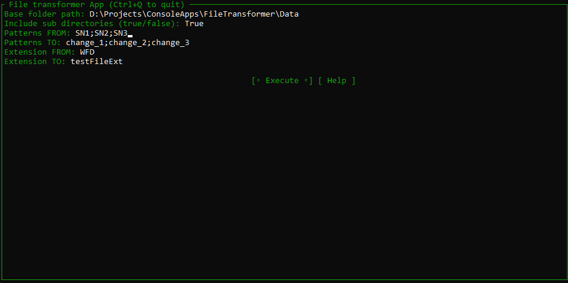
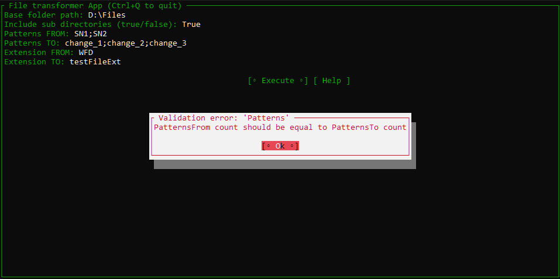

# О проекте

У одного человека была боль: устройство писало на диск в одном формате, а программа визуализации
принимала совершенно другой формат, но с теми же данными. Также должна была быть возможность заменить
подстроки на что-то другое. Что приходилось делать раньше: открывать каждый файл, через поиск+замену искать
и изменять подстроки, сохранять в новом формате. Для решения этой боли и появилось это небольшое консольное
приложение.

# Возможности приложения

Программа обладает следующими возможностями:

1. Обработка файлов с указанным разрешением;
2. Поиск файлов в указанной директории и всех подпапках;
3. Множественная замена подстрок;
4. Сохранение обновленных файлов в файл с тем же наименованием, но с обновленным расширением.

# Локальная сборка

Предусловие:

1. На вашем компьютере должен быть установлен [git](https://git-scm.com)
2. Также необходимо установить [.NET](https://dotnet.microsoft.com/ru-ru/)

Перед использованием необходимо "сбилдить" проект, для этого:

1. Подтяните изменения из этого репозитория:
    ```sh
    git clone https://github.com/olvitmor/FileTransformer.DotNet.Console.git 
    ```
2. Перейдите в папку с проектом:
    ```sh
    cd .\FileTransformer.DotNet.Console
    ```
3. Выполните команду сборки проекта:
    ```sh
    dotnet publish -r win-x64
    ```
4. Перейдите в папку со сбилженным exe файлом:
    ```sh
    cd .\bin\Release\net8.0\win-x64\publish
    ```
5. Используйте получившийся **exe** файл

# Инструкция по эксплуатации

Как только запустится приложение вы увидите интерфейс:




| Краткое наименование | Полное наименование     | Описание                                                                                                | Значение по умолчанию | Описание валидации                                                                    |
|----------------------|-------------------------|---------------------------------------------------------------------------------------------------------|-----------------------|---------------------------------------------------------------------------------------|
| BasePath             | Base folder path        | абсолютный путь к корневой папке, от которой будет вестить работа с файлами                             | -                     | Строка не должна быть пустой; указанная папка должна существовать                     |
| IncludeSubDirs       | Include sub directories | логическое значение "использовать ли подпапки?" (true - использовать)                                   | true                  | -                                                                                     |
| PatternsFrom         | Patterns FROM           | подстрока(-и), которую(-ые) нужно заменить. Используется символ ';' в качестве разделителя              | -                     | Строка не должна быть пустой; количество подстрок должно соответствовать PatternsTo   |
| PatternsTo           | Patterns TO             | подстрока(-и), НА которую(-ые) будет проводиться замена. Используется символ ';' в качестве разделителя | -                     | Строка не должна быть пустой; количество подстрок должно соответствовать PatternsFROM |
| ExtensionFrom        | Extension FROM          | исходный формат файлов                                                                                  | -                     | Строка не должна быть пустой                                                          |  
| ExtensionTo          | Extension TO            | результирующий формат файлов                                                                            | -                     | Строка не должна быть пустой                                                          |

В случае если валидация какого-либо параметра не пройдёт, выскочит сообщение об ошибке:



Если вам потребуется увидеть логи выполнения - необходимо закрыть основное меню (CTRL + Q) и вы увидите логи.

# Используемые библиотеки

- Open source проект [Terminal.Gui](https://github.com/gui-cs/Terminal.Gui)