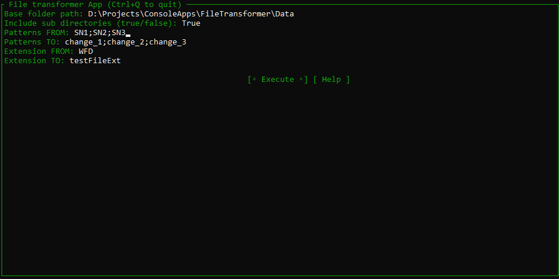

# О проекте

У одного человека была боль: устройство писало на диск в одном формате, а программа визуализации
принимала совершенно другой формат, но с теми же данными. Также должна была быть возможность заменить 
подстроки на что-то другое. Что приходилось делать раньше: открывать каждый файл, через поиск+замену искать
и изменять подстроки, сохранять в новом формате. Для решения этой боли и появилось это небольшое консольное
приложение.

# Возможности приложения
Программа обладает следующими возможностями:
1. Обработка файлов с указанным разрешением;
2. Поиск файлов в указанной директории и всех подпапках;
3. Множественная замена подстрок;
4. Сохранение обновленных файлов в файл с тем же наименованием, но с обновленным расширением.

# Установка
Предусловие:
1. На вашем компьютере должен быть установлен [git](https://git-scm.com)
2. Также необходимо установить [.NET](https://dotnet.microsoft.com/ru-ru/)

Перед использованием необходимо "сбилдить" проект, для этого:
1. Подтяните изменения из этого репозитория:
